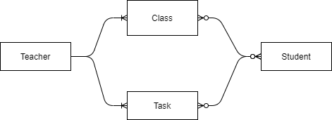
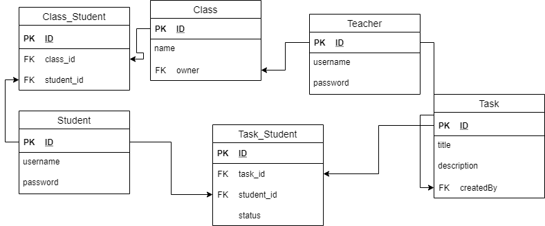

# About project

Educational portal for communication between mentor and mentee.
Application uses Spring Boot + React.js as main backend + frontend technologies.

## To Run
```shell script
// bring up application
mvnw spring-boot:run

// test
curl localhost:8080/api/
curl localhost:8080/api/students/1
// to save a new group
curl -X POST localhost:8080/api/classes -d "{\"uuid\": \"2\", \"name\": \"hufflepuf\", \"owner\": \"http://localhost:8080/api/teachers/1\"}" -H "Content-Type:application/json"
// to update task 
curl -X PUT -H "Content-Type:application/json" http://localhost:8080/api/tasks/1 -d "{\"title\": \"Kill dragon\", \"description\": \"Try to kill dragon in order to survive among mermaids\"}"
// assign task to a student
curl -X POST http://localhost:8080/api/taskStudents -d "{\"uuid\": \"1\", \"student\": \"http://localhost:8080/api/students/1\", \"task\": \"http://localhost:8080/api/tasks/1\"}" -H "Content-Type:application/json"
// add user to a class
curl -X POST http://localhost:8080/api/classStudents -d "{\"uuid\": \"1\", \"classEntity\": \"http://localhost:8080/api/classes/1\", \"student\": \"http://localhost:8080/api/students/1\"}" -H "Content-Type:application/json"

```

## Database design
Entity-relationship diagram
 


Tables
 



### Reference Documentation
For further reference, please consider the following sections:

* [Official Apache Maven documentation](https://maven.apache.org/guides/index.html)
* [Spring Boot Maven Plugin Reference Guide](https://docs.spring.io/spring-boot/docs/2.4.3/maven-plugin/reference/html/)
* [Create an OCI image](https://docs.spring.io/spring-boot/docs/2.4.3/maven-plugin/reference/html/#build-image)
* [Rest Repositories](https://docs.spring.io/spring-boot/docs/2.4.3/reference/htmlsingle/#howto-use-exposing-spring-data-repositories-rest-endpoint)
* [Thymeleaf](https://docs.spring.io/spring-boot/docs/2.4.3/reference/htmlsingle/#boot-features-spring-mvc-template-engines)
* [Spring Data JPA](https://docs.spring.io/spring-boot/docs/2.4.3/reference/htmlsingle/#boot-features-jpa-and-spring-data)

### Guides
The following guides illustrate how to use some features concretely:

* [Accessing JPA Data with REST](https://spring.io/guides/gs/accessing-data-rest/)
* [Accessing Neo4j Data with REST](https://spring.io/guides/gs/accessing-neo4j-data-rest/)
* [Accessing MongoDB Data with REST](https://spring.io/guides/gs/accessing-mongodb-data-rest/)
* [Handling Form Submission](https://spring.io/guides/gs/handling-form-submission/)
* [Accessing Data with JPA](https://spring.io/guides/gs/accessing-data-jpa/)

