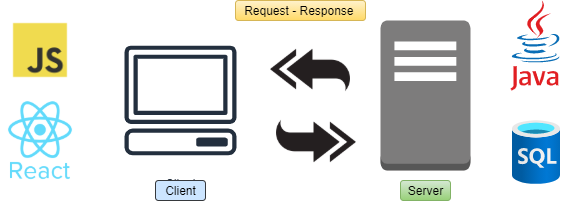
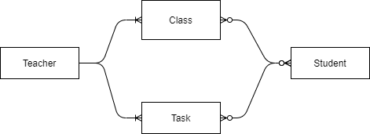
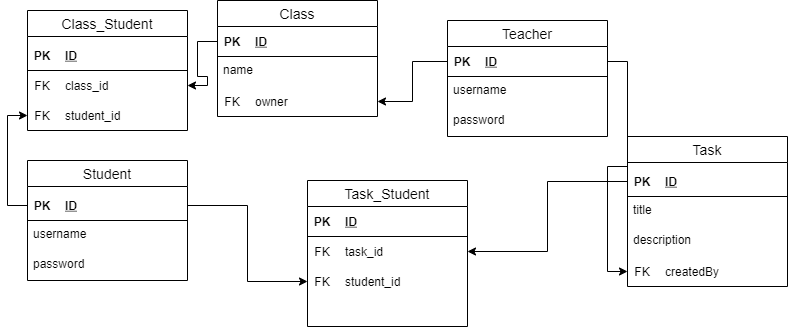

# Project design

Get familiar with project design here

## Project architecture

Application has client-server architecture
 

### Client side 

Frontend is used following technologies: 
+ ReactJS
+ Ant design for UI components
+ Axios for http requests

### Server side

Backend is build with help of:
+ Spring boot
+ Spring data REST
+ Spring JPA
+ Spring security 
+ H2
+ Maven

## Database design

The database for this system was designed with fallowing relationship:
 

You can find how it was implemented below:
 

