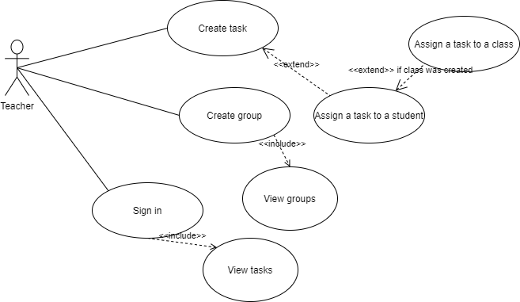
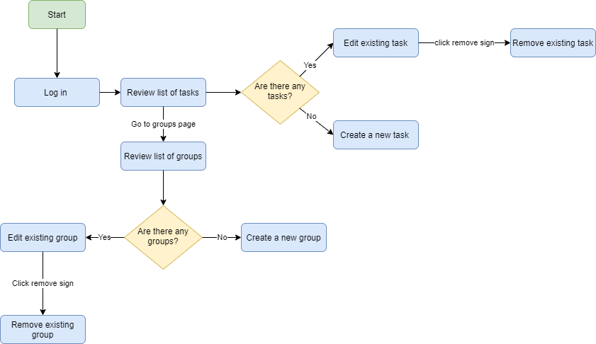

# What you can do

So far The Portal provides only Teacher side functionality. 

## Available functionality
 
+ Login into the system
+ See list of the task created by a teacher
+ Create a new task
+ Assign a task to a student
+ Assign a task to a group
+ Create group
+ Edit task title
+ Edit group title
+ Delete task
+ Delete group
+ Remove student from the group
+ Remove student from the task
+ Remove class from the task
+ Logout

## Use case diagram

## User Flow chart

 